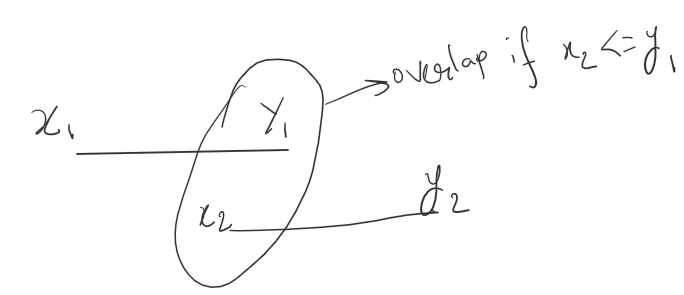
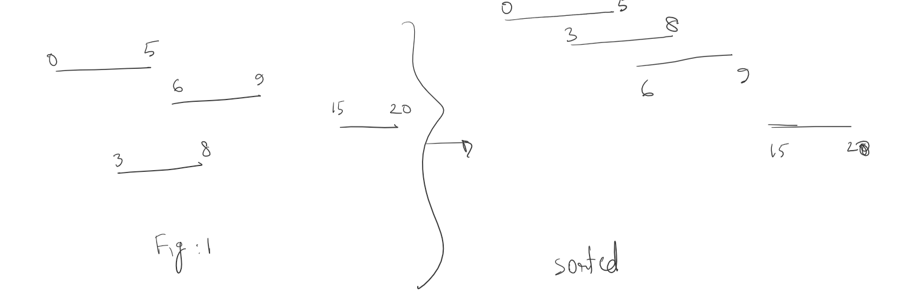

# What is an overlap

# How to find all the overlapping intervals?

We can take an interval and compare it all the previous intervals to find `if xi <= y(i-1).`

But that will take `O(n^2)` time.

We can see from the above image that, if we **sort** the intervals then we can **only compare with the previous interval**!

## Merging intervals:
Every time I find the current interval overlaps with the previous interval, then extend the interval with `x(i-1), max[y(i-1), yi]`

# Time complexity:
Time to sort the intervals: `O(nlogn)`, (n = number of intervals)

Time to Compare each item with the previous item using a loop: `O(n)`

So, total complexity: `O(n+nlogn) ~ O(nlogn)`

# Memory complexity: 
I am keeping one list for result:
In the **worst case** there couldn't me any merge and the size of the result is the size of the input, i.e. `O(n)`

**Best case**: All the input could be merged and there is only one element in the list, then we will need only 1 size of List

# Memory optimization: 
I could have used the input list to store the result, then I would not need any new memory.
